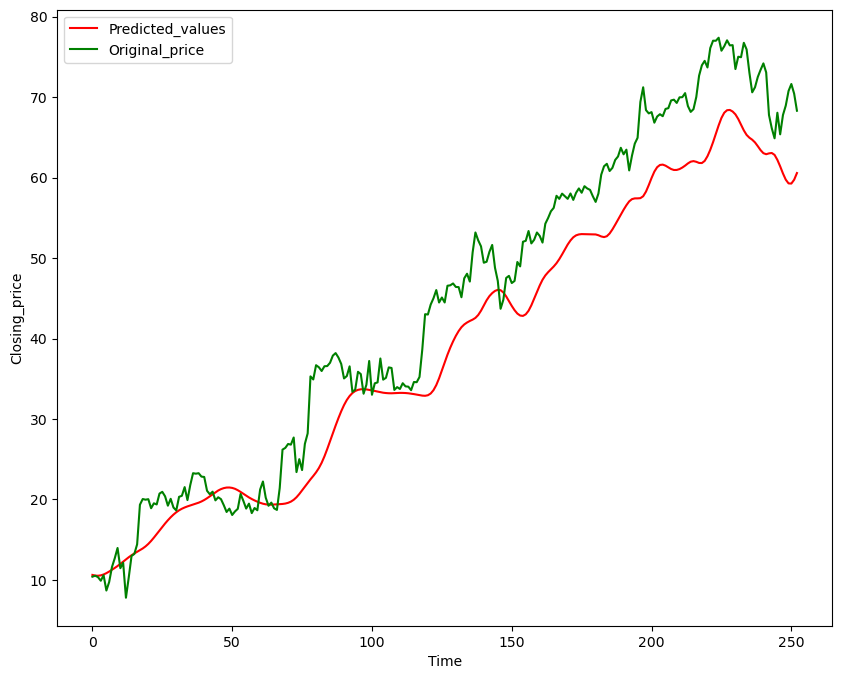

# Stock Price Prediction using LSTM

## Overview
This project predicts Google's stock prices using historical data from **Yahoo Finance** and a **Long Short-Term Memory (LSTM)** neural network. It demonstrates time series analysis, preprocessing, model building, and visualization of prediction performance.

## Dataset
- **Source:** [Yahoo Finance](https://finance.yahoo.com/)
- **Stock:** GOOG (Google)
- **Date Range:** 2012-01-01 to 2022-12-21
- **Features Used:** Closing price

## Steps Involved
1. **Data Collection:** Download historical stock data using `yfinance`.
2. **Preprocessing:**
   - Rolling mean calculation (100-day, 200-day moving averages)
   - Train-test split (80-20)
   - Scaling data using `MinMaxScaler`
3. **Model:**
   - LSTM network with multiple layers & dropout for regularization
   - Optimized with Adam optimizer and Mean Squared Error loss
4. **Prediction:**
   - Evaluate model on test data
   - Convert scaled predictions back to actual prices
5. **Visualization:**
   - Compare predicted vs actual prices using matplotlib

## Requirements
- Python 3.x
- pandas, numpy
- matplotlib
- yfinance
- scikit-learn
- tensorflow / keras

Install dependencies:
```bash
pip install pandas numpy matplotlib yfinance scikit-learn tensorflow
```
Run Code
```bash
python stock_prediction.py
```

## Output
The following plot shows the comparison between the actual and predicted Google stock closing prices:



